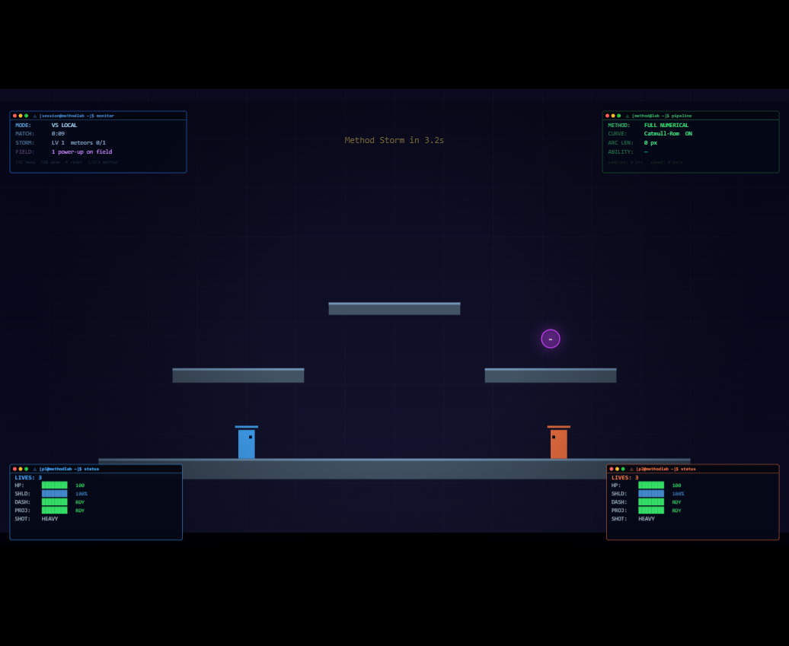

# Spline Fighter: Method Lab Arena

A **Numerical Methods** academic demo — built for *Metode Numerik*, S1 Teknologi Informasi,
Universitas Negeri Yogyakarta — disguised as a 2D local-multiplayer arena fighter. The game
*visibly proves* that numerical methods improve in-game movement, projectile trajectories, and
constant-speed motion.



**▶ Live demo:** https://shattereddarksoul.github.io/spline-fighter/

The whole game is a single file, **`index.html`** (~4200 lines) — vanilla JavaScript + HTML5
Canvas, no build step, no game engine, and **no external math/spline libraries**. The four
numerical methods are implemented from scratch.

---

## The academic point

Press **`1` / `2` / `3`** at any time to switch a global *quality dial* that every ability reads.
The same dash, projectile, or meteor is recomputed three ways so the difference is impossible to
miss:

| Mode | Key | What it does | Why it looks the way it does |
|------|-----|--------------|------------------------------|
| **Linear** | `1` | Straight segments between waypoints | Angular, jerky, *uneven* speed — the deliberately "bad" baseline |
| **Catmull** | `2` | Smooth Catmull-Rom curve, advanced by raw parameter `t` | Smooth shape, but speed is *visibly uneven* (bunching on tight turns) |
| **Full** | `3` | Catmull-Rom **+ arc-length table + reparameterization** | Smooth shape **and** constant speed — the correct result |

Normal walking and jumping are intentionally **not** spline-based. Only *abilities* (dash,
projectiles, meteor reflection) ride the curve, so the method's effect on gameplay is isolated and
defensible. The **Demo Lab** (`TAB`) shows side-by-side comparisons for dash, projectiles, meteors,
power-ups, and impacts.

---

## The four numerical methods

All four live in section 3 of `index.html` and are implemented from scratch.

### 1. Catmull-Rom interpolation — `catmullRomSegment(P0, P1, P2, P3, t)`

For control points $P_0, P_1, P_2, P_3$ and $t \in [0, 1]$, the curve interpolates from $P_1$
(at $t=0$) to $P_2$ (at $t=1$):

$$
\mathbf{B}(t) = \tfrac{1}{2}\Big[\,2P_1 + (-P_0 + P_2)\,t + (2P_0 - 5P_1 + 4P_2 - P_3)\,t^2 + (-P_0 + 3P_1 - 3P_2 + P_3)\,t^3\,\Big]
$$

Applied independently to the $x$ and $y$ components.

### 2. Curve assembly — `buildCurve(waypoints, stepsPerSegment)`

Chains Catmull-Rom segments across all waypoints, using **phantom-endpoint duplication** (the first
and last waypoints are duplicated) so the curve reaches its real endpoints instead of starting at
the second point. Sampling `stepsPerSegment` points per segment yields a dense polyline.

### 3. Riemann-sum arc length — `computeArcLengths(curvePoints)`

Approximates cumulative arc length by summing straight-line distances between consecutive samples:

$$
L \approx \sum_{i} \sqrt{(x_{i+1} - x_i)^2 + (y_{i+1} - y_i)^2}
$$

Returns a **cumulative** array $[\,0,\ d_1,\ d_2,\ \dots\,]$. Finer sampling → a closer
approximation of the true arc length.

### 4. Arc-length reparameterization — `getPositionAtDistance(curvePoints, arcLengths, distance)`

To move at *constant speed*, we query the curve by distance rather than by raw parameter. A
**binary search** locates the bracketing samples $[\,i\!-\!1,\ i\,]$ for the target distance $d$,
then linearly interpolates between them:

$$
t_{\text{local}} = \frac{d - L_{i-1}}{L_i - L_{i-1}}, \qquad
\mathbf{p} = (1 - t_{\text{local}})\,\mathbf{p}_{i-1} + t_{\text{local}}\,\mathbf{p}_i
$$

This is what turns the smooth-but-uneven *Catmull* mode into the smooth-**and**-even *Full* mode.

---

## How to run

The game runs by opening `index.html` in a modern browser. Because it loads PNGs from
`assets/menu/`, serve it over HTTP if `file://` blocks them:

```bash
npx serve          # then open the printed http://localhost URL
# or
python -m http.server   # then open http://localhost:8000
```

The game is **asset-tolerant** — missing PNGs fall back to Canvas-drawn placeholders, so it still
runs with zero external files. There is no build step for the local game.

---

## Controls

**Global:** `1`/`2`/`3` method modes · `TAB` Demo Lab · `P` practice · `I` vs-AI · `R` reset ·
`\` hitbox debug · `Space` restart Demo Lab comparison · `Esc` menu.

| | Player 1 | Player 2 |
|---|----------|----------|
| Move | `A` / `D` | `←` / `→` |
| Jump | `W` | `↑` |
| Attack | `F` | `K` |
| Charge dash | `G` | `L` |
| Projectile | `H` | `;` |
| Cycle shot | `C` | `N` |
| Enhance | `V` | `M` |
| Guard | `S` | `↓` |

**Demo Lab:** `G` dash · `H` projectile · `M` meteor · `U` power-ups · `B` impact lab ·
`Q`/`E` cycle module · `←`/`→` sliders.

---

## Online mode (self-hosted, optional)

The menu includes **VS ONLINE**, a self-hosted 1v1 over Socket.IO. It is a **non-authoritative
input relay**: a small server pairs two players into a room and forwards each player's input to the
other; each client simulates both fighters locally.

1. Run the relay from [`server/`](server/README.md): `cd server && npm install && npm start`.
2. Expose it over HTTPS, e.g. `ngrok http 3000` or `cloudflared tunnel --url http://localhost:3000`.
3. In the game, choose **VS ONLINE**, paste the tunnel URL, and create / join with a 4-character
   room code.

See [`server/README.md`](server/README.md) for full setup and the HTTPS / mixed-content note.

---

## Current limitations

- **Online is a foundation, not full netcode.** Because the relay is non-authoritative, the two
  clients can **drift under latency** — fine for a local/LAN demo, not competitive play.
- **Online reset is disabled** (`R` is ignored in online mode) since a one-sided reset would desync
  the peers.
- **Ultimate "Spline Rush" is reserved but unimplemented** — the slot exists as a placeholder only.

---

## Project documentation

Design spec, requirements, and per-phase handoff notes live in
[`docs/dev-notes/`](docs/dev-notes/). Repository guidance for contributors is in
[`CLAUDE.md`](CLAUDE.md).
